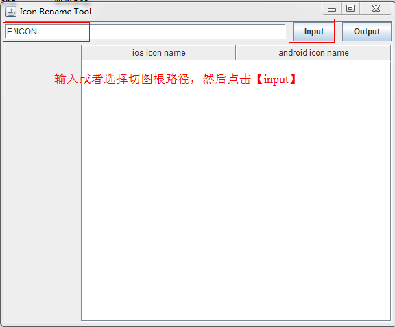
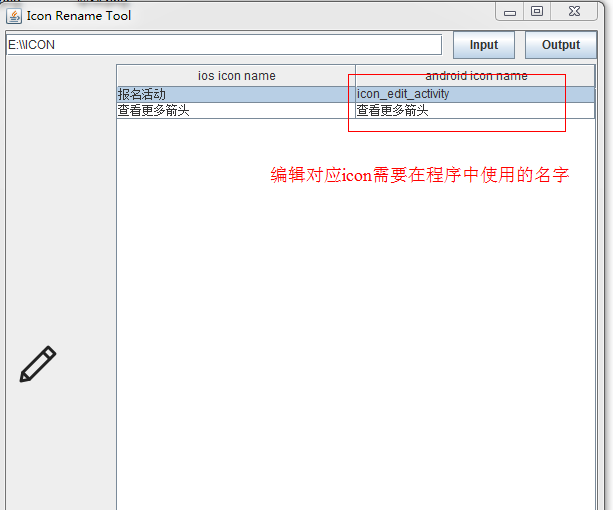
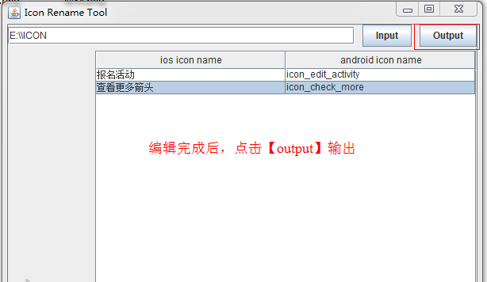
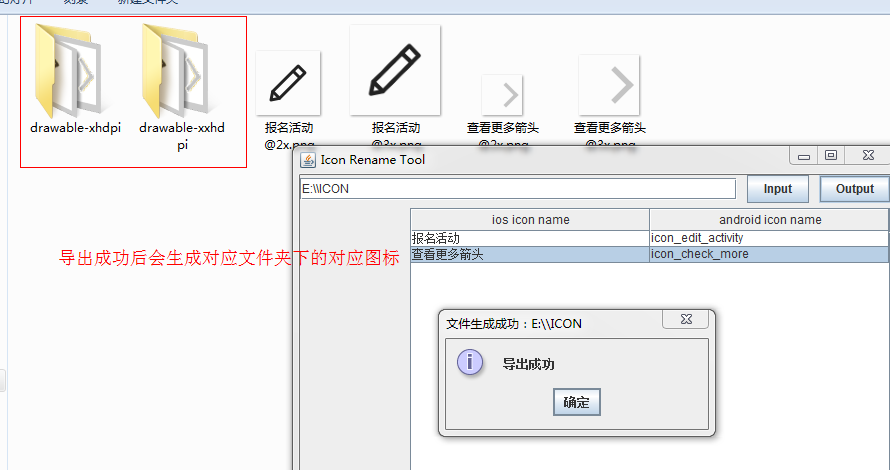

"# rename-icon-tool" 
由于设计资源和开发时间的原因，现在大部分公司App开发只会要求设计出一套iOS的设计稿，一般也是750尺寸（iPhone6）
切图也只会提供2倍图和3倍图。

根据比例换算，最简单的匹配方式，是将2倍图放在Android的xhdpi目录下，3倍图放在xxhdpi目录下，
因此设计师给到如logo@2x.png 和logo@3x.png时，我们可以直接使用工具导出对应文件夹。
使用步骤如下：

直接把生成的图标copy到Android对应的工程就可以了，免去了要修改两遍icon名字的麻烦
